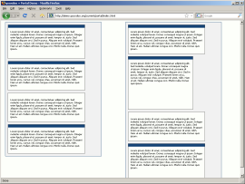

Portal
******

Portal is a DOM-level application that doesn't use any of qooxdoo's GUI widgets. It shows both what you can do using qooxdoo's low-level API and how to build a rudimentary portal application. The various portlets can be freely re-arranged by dragging them to new positions. They also indicate how they can be resized.

