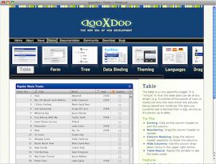

Showcase
********

The Showcase application contains a number of feature "applets" that are actually parts of a single qooxdoo application.  A thumbnails bar allows you to switch between the different demo apps. The topics covered include tabling, themes, internationalization and data binding. With each app there comes instructions and background information, how to exercise them, links to further demos and documentation.

