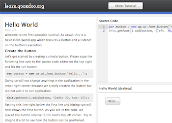

Tutorial
********

|tutorial.png|

The tutorial app is dedicated for absolute qooxdoo beginners. It offers small tutorials taking care of exactly one feature. This includes a simple Hello-World sample but also stuff like from validation or data binding. It offers two types of tutorial: %{Desktop} and %{Mobile}.
