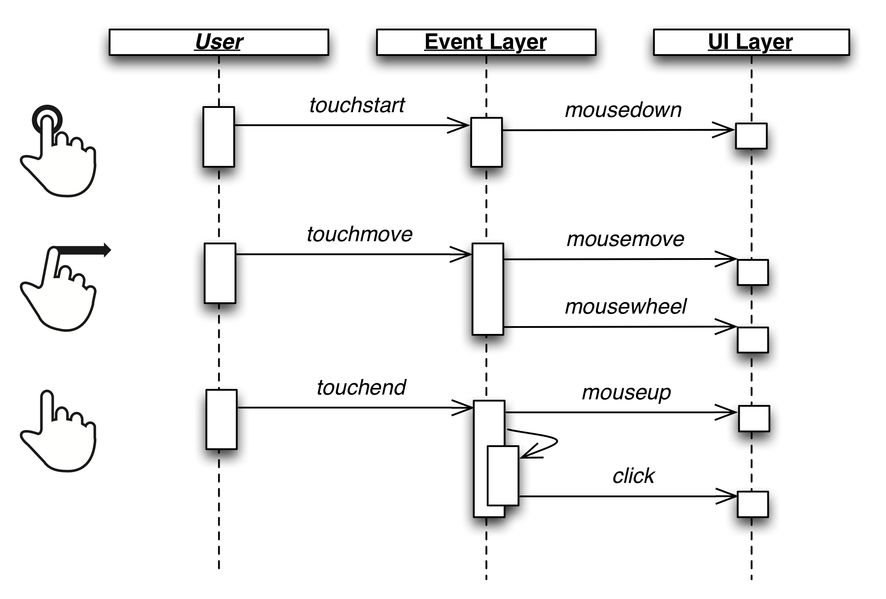

.. _pages/on_mobile#using_deskltop_on_mobile_devices:

Using %{Desktop} on Mobile Devices
**********************************

Modern mobile devices usually supply a standard-compliant web browser, often Webkit-based. The most obvious difference between desktop and mobile browsers is found in the events fired. The desktop browsers supply mouse events, so that events for mouse buttons (up, down, click), hovered items (over and out), scroll and move are available. Mobile devices are typically based on touch interaction and therefore fire touch events. For backward compatibility mobile browsers emulate mouse events natively. Unfortunately, they introduce a slight delay compared to the genuine touch events. This delay is often responsible for a sluggish feel of the UI. The `Apple documentation about handling events <https://developer.apple.com/library/ios/#DOCUMENTATION/AppleApplications/Reference/SafariWebContent/HandlingEvents/HandlingEvents.html>`__ covers the event handling of mobile devices in more detail.

Emulate Mouse
=============
To eliminate the browser-generated delay for mouse events, one has to rely on the touch events instead. Therefore qooxdoo can disable the  mouse event handler regularly used for mouse interaction. A new handler is used internally that listens to the native touch events and emulates the corresponding mouse events. This allows typical %{Desktop} apps to continue to work on touch devices.

How to use it?
==============
Enabling this feature is easy: It is available as an :ref:`environment <pages/core/environment#environment>` setting named ``qx.emulatemouse``. Setting its value to ``true`` in the :ref:`config.json <pages/tool/generator/generator_config_ref#environment>` of an app enables the mouse emulation on devices that natively support touch events.

Technical Realization
=====================
As you might have already guessed, emulating mouse events based on touch events can never cover every event a mouse has to offer. The most obvious events are mouseover / mouseout, as there are no corresponding touch events. Nevertheless the framework's emulation layer does a pretty good job as can be seen in the following overview:

* ``touchstart``: triggers a ``mousedown`` event. Keep in mind that a ``touchstart`` event is also fired when you start scrolling or use any other gesture.

* ``touchmove``: results in two different kind of events. The obvious one is the ``mousemove`` event. The second event is ``mousewheel``, which is responsible for the scrolling behavior. An algorithm for momentum scrolling is included.

* ``touchend``: triggers a ``mouseup`` event.

* ``tap``: is a qooxdoo-based event which is already normalized and fires on a user tap. This results in a ``click`` event.

* ``longtap``: is a qooxdoo-based event which is already normalized and fires if a user touches and holds the finger on the screen. This results in a ``contextmenu`` event.

|emulatemouse.png|

