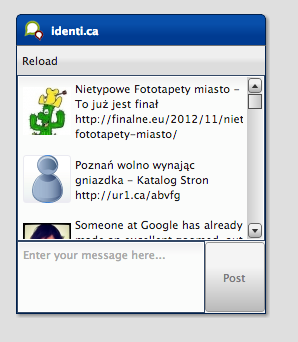

.. _pages/desktop/tutorials/tutorial-part-4-5#tutorial_part_4.5:_virtual_list:

Tutorial Part 4.5: Virtual List
*******************************
This time we will have a look at the virtual widget stuff. The plan is 
to remove the `normal List <http://demo.qooxdoo.org/%{version}/apiviewer/#qx.ui.form.List>`_
and use the `virtual List <http://demo.qooxdoo.org/%{version}/apiviewer/#qx.ui.list.List>`_.
Using the virtual list has a big advantage when we have to render a huge 
count of items. The virtual list only creates widgets for visible items.
This saves memory and execution time. As a base we use the already known
twitter client we built in the :doc:`former tutorials <tutorial-part-3>`.

.. image:: tutorial_4_5-1.png

.. _pages/desktop/tutorials/tutorial-part-4-5#change_the_instantiation:

Change the instantiation
========================

First, we have to use the virtual List instead. Open the
``twitter.MainWindow`` class and search for the list instantiation:
::

    // list
    this.__list = new qx.ui.form.List();
    this.add(this.__list, {row: 1, column: 0, colSpan: 2});

And create a virtual List instead:
::

    // list
    this.__list = new qx.ui.list.List();
    this.add(this.__list, {row: 1, column: 0, colSpan: 2});

Now we use the virtual List instead of the non virtual List. But before
we can use the twitter application with the virtual List we have to
configure the usage with a delegate.

.. _pages/desktop/tutorials/tutorial-part-4-5#configure_the_virtual_list:

Configure the virtual List
==========================

The current implementation uses the list controller to bind the tweets
with the list. This makes it easy to reuse the delegation
implementation, because the delegation `interface <http://demo.qooxdoo.org/%{version}/apiviewer/#qx.ui.list.core.IListDelegate>`_ from the virtual List
has the same methods for ``bindItem``, ``createItem``, ``configureItem``
and ``filter``. We only need to remove the controller stuff and use the
virtual list instead. The controller is not needed anymore, because the
virtual list has its own controller implementation. Open the
``twitter.Application`` and search for the controller instantiation:
::

    // create the controller
    var controller = new qx.data.controller.List(null, main.getList());
    controller.setLabelPath("text");
    controller.setIconPath("user.profile_image_url");
    controller.setDelegate({
      configureItem : function(item) {
        item.getChildControl("icon").setWidth(48);
        item.getChildControl("icon").setHeight(48);
        item.getChildControl("icon").setScale(true);
        item.setRich(true);
      }
    });

Instead of the controller use the virtual List:
::

    // setup list binding
    var list = main.getList();
    list.setItemHeight(68);
    list.setLabelPath("text");
    list.setIconPath("user.profile_image_url");
    list.setDelegate({
      configureItem : function(item) {
        item.getChildControl("icon").setWidth(48);
        item.getChildControl("icon").setHeight(48);
        item.getChildControl("icon").setScale(true);
        item.setRich(true);
      }
    });

Now we have replaced the controller with the virtual List and reused the
delegate implementation. We have only added one line to configure the
default item hight. This is necessary, because the virtual List has no
auto sizing for the item height. This is due to the huge count of model
items.

.. _pages/desktop/tutorials/tutorial-part-4-5#update_list_binding:

Update list binding
===================

Finally, we have to adapt the binding between the twitter service and
the virtual list. The virtual list always needs a model instance so we
need to adapt the current binding:
::

    service.bind("tweets", controller, "model");

We only use a converter which returns an empty model when the service
returns ``null``:
::

    service.bind("tweets", list, "model", {
      converter : function(value) {
        return value || new qx.data.Array();
      }
    });

Now we only need to run the generator to resolve the new dependencies:

The virtual List supports some more features like grouping, for
additional details have a look at the `virtual demos <http://demo.qooxdoo.org/%{version}/demobrowser/#virtual~List.html>`_. As always, the
`code of the tutorial <https://github.com/qooxdoo/qooxdoo/tree/%{release_tag}/component/tutorials/twitter/step4.5/>`_ is on github.