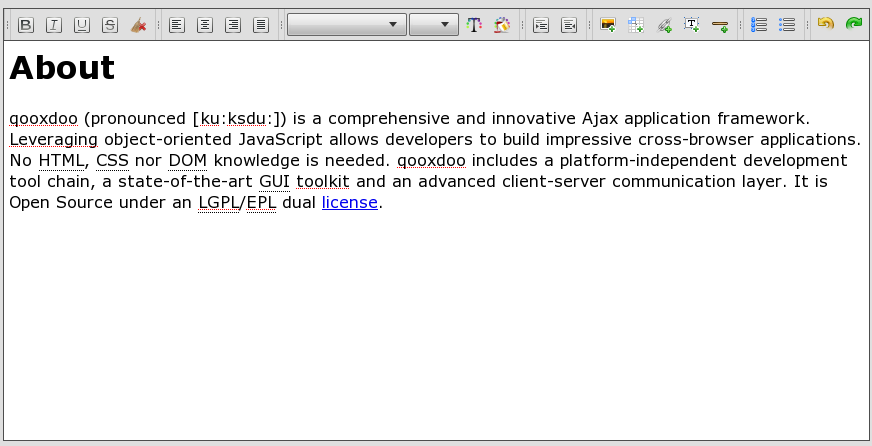

.. _pages/ui_html_editing#html_editing:

HTML Editing
************

HtmlArea is a html editing widget which is part of the framework. This widget is available as `low-level <http://demo.qooxdoo.org/%{version}/apiviewer/#qx.bom.htmlarea.HtmlArea>`_ and `UI-level <http://demo.qooxdoo.org/%{version}/apiviewer/#qx.ui.embed.HtmlArea>`_ implementation. The first targets traditional webpages / single-page applications and the latter Rich Internet Applications (RIA) as preferred usecase.

Here you can find some interesting technical info.

.. note::

  Please keep in mind that the HtmlArea component provides basic HTML editing functionality. It is **not** a full-blown HTML editor and will not be developed towards it.

.. _pages/ui_html_editing#demo:

Demo
====

.. _pages/ui_html_editing#setup:

Setup
=====

One important step is necessary to get the HtmlArea up and running. 

.. note::

  If you setup the component without handing the **source** parameter you have to place a **blank.html** file next to your applications **index.html**.

This is necessary due the `Same-Origin Policy <http://en.wikipedia.org/wiki/Same_origin_policy>`_ implemented by most browsers.

.. _pages/ui_html_editing#features:

Features
========

.. toctree::

   Feature List <ui_html_editing/featurelist>
   Technical Feature List <ui_html_editing/technicalfeaturelist>

.. _pages/ui_html_editing#integration_guide:

Integration Guide
=================

.. toctree::

   Integrate the HtmlArea in your application <ui_html_editing/integration_guide>
   Available keyboard shortcuts <ui_html_editing/available_shortcuts>
   Recommendations <ui_html_editing/recommendations>

.. _pages/ui_html_editing#technical_background:

Technical Background
====================

.. toctree::

   General information about HTML Editing <ui_html_editing/html_editing_in_general>
   Copy and Paste <ui_html_editing/copy_and_paste>
   Text Align <ui_html_editing/textalign>
   Browser Bugs <ui_html_editing/browser_bugs>
   Default Paragraph Handling <ui_html_editing/default_paragraph_handling>

.. _pages/ui_html_editing#implementation_details:

Implementation Details
======================

.. toctree::

   Undo and Redo <ui_html_editing/undo_redo>
   Paragraph Handling <ui_html_editing/paragraph_handling>
   List Handling <ui_html_editing/list_handling>

