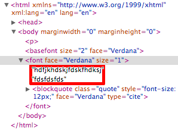

.. _pages/ui_html_editing/browser_bugs#browser_bugs:

Browser Bugs
************

.. _pages/ui_html_editing/browser_bugs#gecko:

Gecko
=====

* **Gecko 1.8** *needs* a `` `` tag inside an element with ``contenteditable="true"``, even if the element is empty! If no such element existes, Gecko automatically adds it. These elements can be recognized by the proprietary attribute *_moz_editor_bogus_node*: `` ``
* **Gecko 1.9** will *always* insert this `` `` tag, if ``contenteditable="true"`` is set. Even if the element contains content! This `` `` tag is removed, as soon as any input is entered by the user: https://bugzilla.mozilla.org/attachment.cgi?id=119342
* **Undo/Redo** : it *could* happen that 2 content changes occuring right after another leading Gecko to remove both of these 2 changes in **one** undo step. This is especially important for the undo/redo stacks of the HtmlArea.

.. _pages/ui_html_editing/browser_bugs#internet_explorer:

Internet Explorer
=================

* If you want to use the ``pasteHTML()`` function, you have to select the textrange first using ``select()``.

.. _pages/ui_html_editing/browser_bugs#webkit/safari:

Webkit/Safari
=============

* Setting a background color for text on *collapsed* selection is not working like in Gecko or IE. Instead of setting the background color and allowing the user to type ahead in the new background color (like in Gecko/IE) nothing happens. The current solution in the HtmlArea is to select the word currently under the caret and to set the background color on this selection. Working on a user-selection works as expected.

* | Deleting a block element (e.g. an 
 tag) can cause an element to contain *two* text nodes:
  | |webkit bug|
  | This wrong behavior  can cause problems with selections.
    

