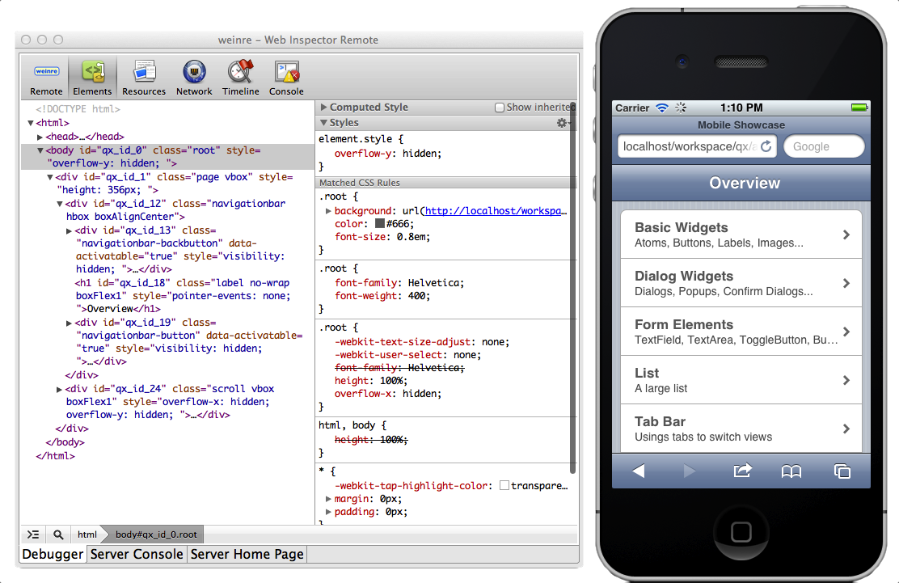

.. _pages/mobile/debugging#debugging:

Debugging
*********

Debugging with desktop browsers
===============================

You can easily debug your qooxdoo mobile applications on your machine, by using desktop browsers like Safari, Chrome or
Mozilla Firefox.
In case of webkit browser you have to open the pre-installed developer tools. In Firefox you must have installed
the add-on "Firebug".

Remote debugging with weinre
============================

Sometimes there are errors, that only occur on the mobile device. Debugging CSS or runtime-specific JS code can be challenging, if the application is running in the mobile browser or is deployed as a native app via PhoneGap.

If you want to debug your qooxdoo mobile application on a mobile device, we propose
using a web remote debugger called "weinre":

`weinre - Web Inspector Remote <http://phonegap.github.com/weinre/>`_

Remote debugging allows a developer to use the browsers developer tools from a desktop computer while inspecting and manipulating the website on the mobile device.

Here are some hints for enabling remote debugging on your qooxdoo mobile application with weinre:

  * Install weinre according to the weinre manual. Create a server.properties file,
    and change the port number to 8081 or similar.

  * Add the following script tag to the index.html in your qooxdoo mobile application:

    ````

  * Replace ip placeholder with your desktop computer ip on your "index.html".

  * Start weinre.

  * Call your qooxdoo mobile application from your mobile device.

Important: Please make sure, not having the character "#", behind the "index.html" on your url.
Weinre uses debug ids, which are appended after the target url, just like *"..qooxdoo/foo/../index.html#anonymous"*.
On mac computers "anonymous" is the default debug id. Any other debug id, results in a disconnect of 
target mobile device. 

Unfortunately, there is a clash with qooxdoo mobile navigation logic. Qooxdoo navigation manager uses 
also the number sign, for navigating through pages:

*"../mobileshowcase/source/index.html#/form"*

So, if you navigate to a subpage with qooxdoo, and reload the page, weinre interprets
*"#/form"* as the debug id *"/form"*. On mac computers, only "anonymous" is allowed, so
the target device disconnects from debug server.

This means, debugging with weinre works fine, as long as you do not reload a 
subpage of your qooxdoo mobile page. Your starting point for remote debugging should
always be the "index.html" without any strings attached.

Using browser instead of weinre client
======================================

Instead of using the weinre debug client, you can also use your webkit desktop browser (Safari or Chrome) for remote debugging.

The newest versions of webkit browsers and their debuggers might have more functions than the 
weinre debug client. 

Just open the weinre debugging client with following URL:

``http://localhost:8081/client/``

