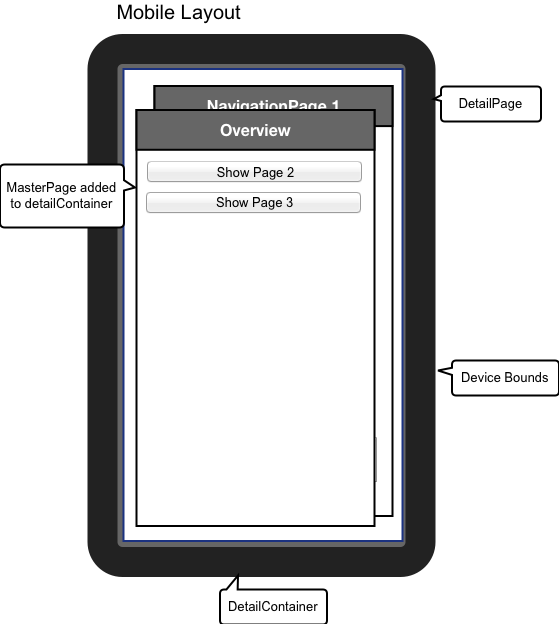
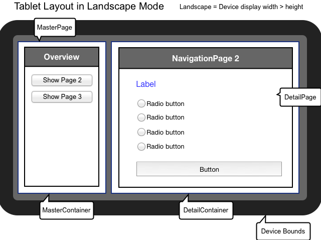
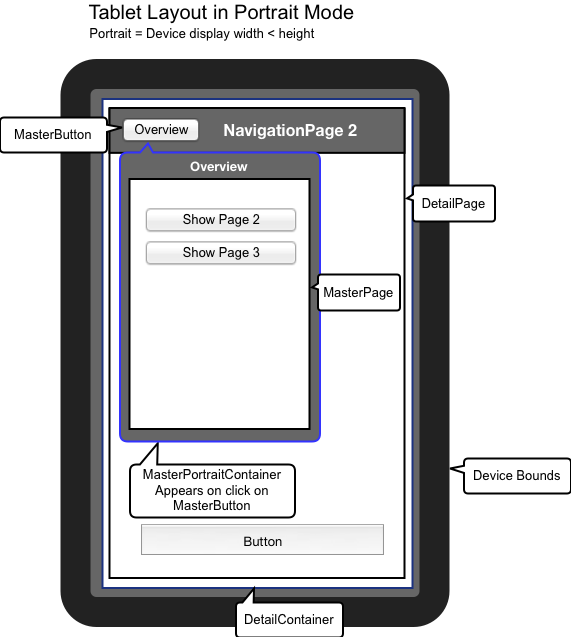

.. _pages/mobile_tablet_switch/#mobile_tablet_switch:

Mobile and tablet switch
************************

Tablet support out of the box
=============================

On tablet devices you have a bigger screen size and more layout space than on
mobile devices. An application in a tablet device context may even provide additional/other functions 
than on mobile device context. 

%{Mobile} provides mobile and tablet distinction out of the box. It provides a detection of
device type the application runs on. 

Based upon this distinction, you can tell our page manager whether it should layout its
navigation pages optimized for device class mobile (intended for mobile, 7'' tablets) or device class tablet (tablets or desktop).

How to get device type
======================

The device type is accessible by the environment variable ``device.type``.
It is able to detect 3 classes:  ``mobile``, ``tablet`` and ``desktop``.

::

   var deviceType = (qx.core.Environment.get("device.type");

Device type mapping table :
---------------------------

The device type is detected by resolving user agent strings.
Device class mapping is done by searching a specific hardware class, 
an operation system or a browser type.

**Tablets** (returns ``tablet``)

* Android Tablet
* iPad
* Blackberry Playbook
* Amazon Kindle
* Silk
* Sony PSP

**Mobile** (returns ``mobile``)

* Android mobile phones
* iPhone
* iPod
* Bada
* Maemo
* Symbian
* Windows Phone
* Opera Mobile 
* Fennec

**Desktop** (returns ``desktop``)

* All other devices

How to enable device-based layouting
====================================

The device-based layouting is handled by ``qx.ui.mobile.page.Manager``.
In our examples at mobile playground and the tutorial, we always make usage of this manager to create
a %{Mobile} application.

::
   
   var isTablet = false;
   var manager = new qx.ui.mobile.page.Manager(isTablet);
   var page = new qx.ui.mobile.page.NavigationPage();
   manager.addDetail(page);
   page.show();

The manager has an optional constructor parameter ``isTablet``.
It indicates whether the page manager uses the mobile or the tablet layouting mode. In this 
examples, we deactivated tablet layout mode with ``isTablet=false``.

If parameter ``isTablet`` is not defined at constructor, the page manager always calls environment variable 
``device.type`` to determine the layout mode. Tablet layout mode is active by default, if environment variable 
is ``desktop`` or ``tablet``.

How page manager arrange pages
==============================

The class ``qx.ui.mobile.page.Manager`` works with instances of ``qx.ui.mobile.page.NavigationPage``.
The manager arranges the pages on screen, based on flag ``isTablet`` and device orientation.

An device/window orientation change is detected by %{Mobile} and fires an ``orientationchange`` event, which is handled by page manager.

MasterPages and DetailPages
---------------------------

When page manager is on tablet mode, it arranges the NavigationPages in a different order than on 
mobile mode. For this arrangement it needs to know, whether a NavigationPage is important for application flow, 
and which are not.

For this arrangement logic the instances of ``qx.ui.mobile.page.NavigationPage`` needs to be added as a MasterPage or a DetailPage.

MasterPages are usually used as navigation. They control the appearance of several DetailPages.
A MasterPage should always be visible for controlling the application flow.

DetailPages do contain the content, or more precise: they show a detail information. It is not necessary for application flow, that a 
DetailPage is always visible.

When no tablet support is necessary, every page can be added as a detailPage.

Page manager layout modes
=========================

There are 3 different layouting modes, used by ``qx.ui.mobile.page.Manager``.

Mobile Layout
-------------

Used when ``isTablet`` of page manager is ``false``.

All MasterPages and DetailsPages are added to DetailContainer.

Tablet Landscape Layout
-----------------------

Used when ``isTablet`` of page manager is ``true`` and orientation is portrait.

MasterPages are added to ``masterContainer``. DetailPages are added to ``detailContainer``.

Tablet Portrait Layout
----------------------

Used when ``isTablet`` of page manager is ``true`` and orientation is landscape.

MasterPages are added to a ``PortraitMasterContainer``. This container is hidden after orientation change.
Visibility of this container can be controlled by MasterButton. The caption of the MasterButton and the title 
of ``PortraitMasterContainer`` are bound to shown MasterPage's title.

Example for a %{Mobile} application with tablet support
=======================================================

Now, that you gained this knowledge about %{Mobile} tablet support, you 
surely want to create an application using this feature.

::
   
   var manager = new qx.ui.mobile.page.Manager();
   
   var masterPage = new qx.ui.mobile.page.NavigationPage();
   var detailPage1 = new qx.ui.mobile.page.NavigationPage();
   var detailPage2 = new qx.ui.mobile.page.NavigationPage();
   
   manager.addMaster(masterPage);
   manager.addDetail([detailPage1,detailPage2]);
   
   masterPage.show();
   detailPage1.show();

In the example above, we first create a page manager. To this manager we add ``masterPage``.
You could even add multiple MasterPages.

This MasterPage could be used as a menu or overview page to control visibility of DetailPages.
The DetailPages can be added as an array, for convenience.

At last step you have to define which pages are visible at startup.

Page manager does not manage startup visibility, because this give you full control 
about application flow.
