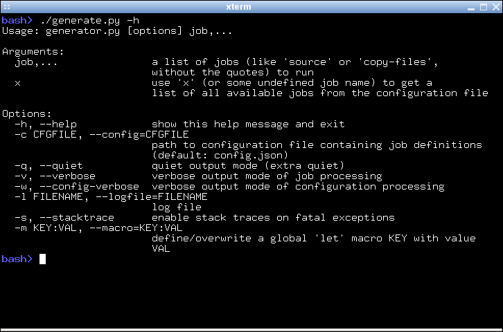
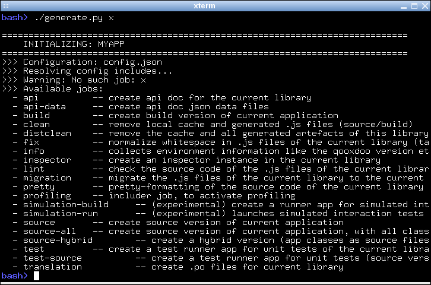

Tutorial: Basic Tool Chain Usage
--------------------------------

In various introductions and tutorials you were using the qooxdoo tool chain
casually along the way. Now it's about time to take a more systematical
look. The main interface to invoke the tool chain is the *generate.py*
script that is part of every skeleton, often colloquially referred to as
"the generator". In each qooxdoo library or application, it sits next to
the library's *Manifest.json* and the default configuration file,
*config.json*. The *Manifest.json* file is the main declaration file for
any qooxdoo app, it's constitutional document if you will. *config.json*
is the configuration file that steers the generator and its actions.
When invoked, the generator looks for a file of this name in the current
directory for default instructions, but you can supply an alternative
configuration file with a command line option. Invoking
::

    generate.py -h |--help

gives you a complete list of those options.

|image0|

In the simplest case the generator takes the name of a *job* to perform
as its sole argument. Supplying a non-existing job name will result in
the generator providing a list of known jobs which it can perform. You
can try this by using a made-up job name like "*x*"::

    generate.py x

The ensuing list can be daunting at first, but we will pick out the most
important jobs here.

|image1|

Generating a Runnable App
~~~~~~~~~~~~~~~~~~~~~~~~~

The most important job of the generator is to create a version of your
application that you can run in the browser. This is surprising for many
people at first. Why do I need to "generate" a working application, when
I have written my JavaScript and have an index.html handy? Why not just
load the app right away? The answer is that qooxdoo is not a
prefabricated JS library that you just *<script>*-include in your HTML
page. For each application exactly those classes are selected that are
necessary to run it. This avoids any overhead of carrying unnecessary
code with your app. To achieve this, an individual piece of JavaScript
code is generated, the so-called *loader*. For any qooxdoo application,
this loader is the first file to be loaded and evaluated in the browser,
and it makes sure all necessary component of the application get loaded
after it as well. Besides many other benefits that can be achieved, this
is the central reason to have a generation step before a qooxdoo app can
be run.

Use the Source, Luke
~~~~~~~~~~~~~~~~~~~~

The tool chain is able to generate your application in various flavors.
This is reflected by the available generation jobs, "source", "hybrid", "source-all" and "build". The most important for starting and
building up your app, are the source jobs. Running ::

    generate.py

will generate the so-called "source version" of your application in the default variant. 

In general, the source version of an app is tailored towards development activities. It
makes it easy to write code, run the application, test, debug and
inspect the application code, fix issues, add enhancements, and repeat.

In the :ref:`source <pages/tool/generator_default_jobs#source>` job, all the classes of the app are in their original source form, and loaded from their original file paths on the file system. 
If you inspect your application in a JavaScript debugger like Firebug or
Chrome Developer Tools, you can identify each of your custom files individually, read
its code and comments, set breakpoints, inspect variables and so forth.
This job is particular interesting when you want to debug classes outside your custom application, e.g. if you are debugging another library along the way.

You only have to re-run this generator job when you introduce new
dependencies, e.g. by instantiating a class you haven't used before.
This changes the set of necessary classes for your application, and the
generator has to re-create the corresponding loader. 

In the :ref:`source-hybrid <pages/tool/generator_default_jobs#source-hybrid>` version, the generator will concatenate class files into a bunch of script files, except for your application classes, which are loaded directly from their original path on the file system. This allows for a reasonable loading speed of your application in the browser, while still providing convenient debug access to your own class files.

With :ref:`source-all <pages/tool/generator_default_jobs#source-all>` all existing classes will be included, be they
part of your application, the qooxdoo framework, or any other qooxdoo
library or contribution you might be using. All those classes are
included in the build, whether they are currently required or not. This
allows you develop your code even more freely as you don't have to
re-generate the application when introducing new dependencies. All
classes are already there, after all. The down-side is that due to the
number of classes your app loads slower in the browser, so it's a
trade-off between development speed and loading speed. 

So if you are just getting
started with qooxdoo development, use the *source-all* version, which is
the most convenient if you are not too impatient. If you are concerned
about loading speed during development, but don't mind hitting the up
and return keys in your shell window once in a while, go with the
default *source-hybrid* job. If your emphasis on the other hand is on
inspection, and you want to see exactly which class files get loaded
into your app and which code they provide, the *source* version
might be your preference.

A Deployment Build
~~~~~~~~~~~~~~~~~~

On the other end of the spectrum there is the ``build`` version of you
app. The "build" version is what you want to create at the end of a
development cycle, when your app is stable and you want to deploy it
into production. Running ::

    generate.py build

will create a highly optimized version of your app. All necessary code
is stripped, squeezed and compressed, and put into as few JS files as
possible. Everything is geared towards small size, fast transport, fast
loading and minimal memory footprint. Along with the code, all other
required resources, such as icons and images, are collected together
under a common root directory, usually named ``build``. The good thing
here is that this makes the contents of this directory self-contained so
you can copy it to the document tree of a web server, zip it up and send
it by mail, and so forth. All necessary content will come along, and the
app will just run when the contained *index.hmtl* is loaded. For an
example let's suppose you have an application ``myapp`` and a web server
instance running on a machine called ``fooserv``. Then, given suitable
network connection and setup, the following command will copy your build
version to the web server::

    scp -r build bar@fooserv:~/public_html/myapp

and you can load it in the browser with ::

    http://fooserv/~bar/myapp/

Non-App-Generating Jobs
~~~~~~~~~~~~~~~~~~~~~~~

So now you know about the basic jobs to create a runnable application
using the generator. There is a whole bunch of jobs that is not
concerned with creating a runnable version of your app, but do other
things. One of those is addressed in the :doc:`Twitter tutorial </pages/desktop/tutorials/tutorial-part-4-3>` which is
concerned with internationalization of an application. The generator job
in this context is ``translation``, and extracts translatable strings
from your JavaScript source files into *.po* files. Here is a quick
topical overview of those kinds of jobs: 

Internationalization:

-  ``translation`` -- extract translatable strings into .po files

Source Code:

-  ``lint`` -- check source code for potential issues
-  ``fix`` -- fix white space in source code
-  ``pretty`` -- re-format source code

Development:

-  ``api`` -- create an application-specific instance of the Apiviewer
-  ``test`` -- create an application-specific instance of the Testrunner
-  ``inspector`` -- create an application-specific instance of the
   Inspector
-  ``simulation-build`` -- create a GUI testing application (to be used
   with Selenium)

Files:

-  ``clean`` -- clean up generated files for this app
-  ``distclean`` -- clean up generated files for this app, and delete
   the generator cache

As mentioned before, for a full list of available jobs with short
descriptions run ``generate.py x``, or see the
the list of `default jobs <generator_default_jobs>`_.

Tweaking Jobs
~~~~~~~~~~~~~

For most people the jobs that come with qooxdoo are good enough to get
all necessary work done. But not for all. Sometimes you want the output
file be named differently; or the index.html that loads your qooxdoo app
lives in some other part of your web space; or you want to get rid of a
specific optimization in your build version. Fortunately, the tool chain
of qooxdoo is very flexible and highly configurable. There is a set of
built-in functionality that can be drawn upon by job definitions, and
jobs can be freely defined or altered. The system is in fact so
configurable that we have thought of means of limiting its flexibility,
for the sake of an easier user interface. If you feel you want to change
the way in which the generator works, try the following three levels
which go from simple (but less powerful) to advanced (but more
challenging):

#. **Macros** The first and simplest level to tweak the generator are
   configuration macros. These are simple strings that can have a value,
   and that are used in job definitions where they are eventually
   replaced by their value.
#. **Overriding Existing Jobs** The next level would be to take an
   existing job (one that comes predefined with qooxdoo), and change
   some of its settings so it better suits your needs. This is achieved
   by overriding or "shadowing" an existing job in your own config.json.
#. **Custom Jobs** You can of course define entirely new jobs from
   scratch. This is the most challenging approach, and requires you to
   understand a bit about how the generator works internally, and what
   settings you have to specify in your job definition to make
   everything work out.

We will look at each of these levels in turn.

Macros
~~~~~~

Macros are simple named placeholders that are used in generator
configuration files. They make it easy to define values that are used in
multiple jobs in a single place (e.g. the application name), or expose a
value in a specific job so this value can be customized (e.g. a list of
packages to ignore when building an application-specific Apiviewer). One
way to change a macro is to edit the *config.json* file of your
application. Start your favourite text editor and load the configuration
file.

|image2|

Let's suppose you want to add support for additional locales to your
application. Then locate the ``"let"`` entry in the configuration map.
The let key lets you define macros. Locate the macro named *"LOCALES"*,
and add two more locales so the value looks something like this: *[
"en", "fr", "de" ]*. With the next run of generate.py translation files
*fr.po* and *de.po* will be added to your *source/translation* directory.

There is also the possibility to pass a macro definition on the command
line when you invoke the generator::

    generate.py source --macro  CACHE:/tmp/cache

This tells the generator to use the path */tmp/cache* for its caching.
Passing macros in this manner allows you to change a macro on a
per-invocation basis. The command-line value will take precedence over a
potential existing definition in config.json.

Overriding Existing Jobs
~~~~~~~~~~~~~~~~~~~~~~~~

The second approach that goes beyond just modifying a macro is to
override an existing job. The default *config.json* comes with a
commented-out sample for this. Let's suppose you want to get rid of the
extra newlines that are sprinkled throughout the build version of your
app. In the *"jobs"* section of the config you find a job entry named
*"build-script"*. It has a sub-key *compile-options/code/format* (the "/" 
indicates nesting in the Json maps) which is
set to false (the default is true). Just uncomment this job and run
generate.py build again, and you'll find all newlines gone from the
generated code. This illustrates the general principle:

#. **Identify the job you are not contempt with.** This might require
   that you look at the generator output, or consult the basic
   configuration file, *tool/data/config/base.json*, as some jobs which
   you can invoke with the generator are broken down in sub-jobs.
#. **Add an entry of the same name in your config.json.** The generator,
   once you run it the next time, will indicate this by issuing a hint
   in the console output that the respective job has been shadowed.
#. **Add those keys to the job entry that you want to change, with
   suitable values.** Use the default job's definition to find out which
   config key you need to tweak. To achieve this you can look at the
   job's definition, e.g. in ``base.json``, or run the generator with
   the ``-w`` command line flag; this will print the full job definition
   before the job is run.

As mentioned above, on the next time you run the generator it will
indicate that you have successfully overridden a predefined job. The
message will be something like this:

.. code-block:: console

      - Warning: ! Shadowing job "build-script" with local one

(This is also helpful to prevent you from accidentially overriding an
existing job with a custom job that is supposed to be new).

Custom Jobs
~~~~~~~~~~~

Custom jobs are jobs that you freely define in your config.json. You add
them to the "jobs" section just as in the previous step, but making sure
you are **not** using an existing name for them (check the generator
console output when you run the job to make sure). The challenge with a
custom job is that you have to build it up from scratch, and it might
take you through some trial-and-error until you come up with a job
definition that is fully functional. To help you with that, many basic
configuration entries that almost any job would need are available in
dedicated job definitions of their own (like ``"cache"`` or
``"libraries"``), and we recommend using them. (This gives you another
hint at the configuration system of the tool chain: Jobs need not do
anything useful; they can also just be containers for configuration
snippets that can be included in other jobs to make their definition
more modular or compliant). Here is a simple custom job that just copies
two files to the build path of the application::

    "myjob" :
    {
      "extend" : ["cache"],
      "copy-files" :
      {
        "files"  : ["foo1.txt", "foo2.txt"],
        "source" : "/home/myhome/tmp",
        "target" : "./build"
      }
    }

Don't forget to add the entry *"myjob"* in your config's ``"export"`` list,
so it is available on the command line. 

Further Resources
~~~~~~~~~~~~~~~~~

* If you want to embark on the effort of creating custom jobs you're well-advised to make yourself familiar with the :doc:`general generator configuration overview <generator_config>`, and
* the :doc:`reference of configuration keys <generator_config_ref>` that can be used. 
* Also, there is an example configuration file in *tool/data/config/example.json* to look at.
* The basic configuration file, *tool/data/config/base.json*, 
* and the configuration files for the Testrunner (*component/testrunner/testrunner.json*)
* and Apiviewer (*component/apiviewer/api.json*) also provide good examples to learn from.

.. |image2| image:: tutorial_basics/generate_config2.png
