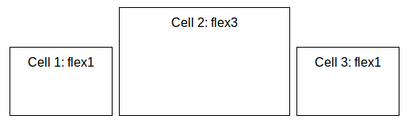

Layouts
=======

%{Website} contains support for [CSS flexbox layouts](http://www.w3.org/TR/css-flexbox-1/), a layout system where items are dynamically resized to fit the available space.

See this [guide on css-tricks.com](http://css-tricks.com/snippets/css/a-guide-to-flexbox/) for a detailed explanation of the spec.

qooxdoo's predefined flexbox CSS classes are compatible with all modern browsers (current versions of Firefox and Chrome, Internet Explorer 10+).

Examples
--------

### Horizontal Box with flex-align: end



``` {.sourceCode .html}
<body class="qx-flex-ready">
  <div class="qx-hbox qx-flex-align-end">
    <div class="qx-flex1">Cell 1: flex1</div>
    <div class="qx-flex3">Cell 2: flex3</div>
    <div class="qx-flex1">Cell 3: flex1</div>
  </div>
</body>
```

### Vertical Box with flex-direction: row-reverse and flex-align: center


``` {.sourceCode .html}
<body class="qx-flex-ready">
  <div class="qx-vbox qx-flex-reverse qx-flex-align-center">
    <div class="qx-flex1">Cell 1: flex1</div>
    <div class="qx-flex3">Cell 2: flex3</div>
    <div class="qx-flex1">Cell 3: flex1</div>
  </div>
</body>
```

Including the flexbox styles
----------------------------

The flex layout classes are defined in [SASS](http://sass-lang.com/) files which are used to generate the CSS for %{Mobile} as well as %{Website}. To include them in your own project, simply create an include file (e.g. `layout.scss`):

``` {.sourceCode .css}
@import "<qooxdoo_sdk_path>/framework/source/resource/qx/scss/_mixins.scss";
@import "<qooxdoo_sdk_path>/framework/source/resource/qx/scss/_layout.scss";
```

And use the SASS compiler to generate a CSS file:

``` {.sourceCode .bash}
sass layout.scss layout.css
```
