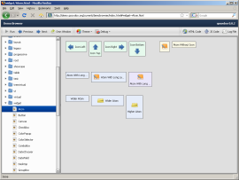

Demobrowser
***********

Demobrowser is a runner frame application that hosts nearly 250 sample applications. All those applications are full, stand-alone qooxdoo applications. They cover a wide range, from simple layout test apps to more full-featured form applications. But the focus is usually to exercise a particular widget or feature of the qooxdoo class library. So while they might be simple visually, they are good resources to see how a specific feature can be used in an app. As they are generated in three variants, one for each of qooxdoo's standard themes, you can get an impression how the same application looks under the different themes.

To navigate these demo applications, the runner frame organizes them in a navigation tree that groups applications by main feature (like data binding, layouts, events, etc.). It also allows you to search for demo titles and qooxdoo classes used in the demos, so you can e.g. search for all demos that deploy qooxdoo's List widget (qx.ui.form.List). For each rendered app you can inspect the JavaScript source to see how it is done.
