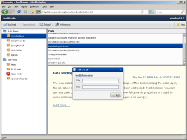

Feedreader
**********

Feedreader is a browser-based RSS feedreader. It allows you to read posts of pre-defined feeds, but you can also add other feeds in a session. The indiviudal feeds are retrieved using YQL queries. It also showcases switching the language for an application, offering seven languages to choose from. As it uses internet access, internationalization and is organized in parts on the code level, it shows several features of prototypical RIA applications.

