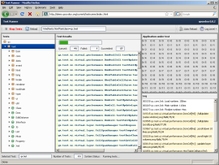

Testrunner
**********

Testrunner is a runner frame application for unit tests. Unit tests can be written using framework classes from the ``qx.dev.unit.*`` name space. They follow the general scheme of `JSUnit <http://www.jsunit.net/>`__. Test class are then gathered into a dedicated test application (the "Application under Test"). This test application is loaded into the runner frame, which discovers and displays the contained tests, and allows you to run them all or individually. Results and log entries are displayed in dedicated panes.

The online Testrunner loads qooxdoo's own framework unit tests (approx. 1,500 unit tests currently), but a custom testrunner can be created for each custom application, to run that application's unit tests.
