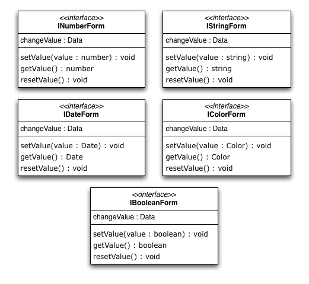
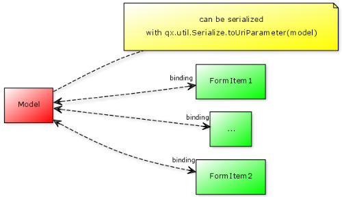
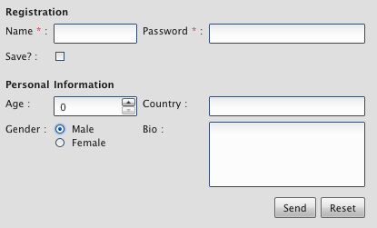
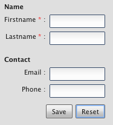

.. _pages/gui_toolkit/ui_form_handling#form_handling:

Form Handling
*************

The ``qx.ui.form`` package contains several classes to for constructing forms. Some widgets -- like ``Button``, ``List`` or ``TextField`` -- may look familiar if you have worked with HTML before, but this package also contains more complex widgets that you may know from your operating system and/or native desktop applications (e.g. ``Spinner``, ``Slider`` or ``DateField``).

.. _pages/gui_toolkit/ui_form_handling#idea_1:

Idea
====
The idea of the form API is to make handling of form widgets as simple as possible, but also as generic as possible within the entire framework. There has been a thorough `discussion <http://bugzilla.qooxdoo.org/show_bug.cgi?id=2099>`_ on what's the best solution and how to design a solid API. This is what we ended up with. 

.. _pages/gui_toolkit/ui_form_handling#demos:

Demos
=====
If you like to see some of the form management of qooxdoo in action, take a look at the following samples in the demo browser:

.. _pages/gui_toolkit/ui_form_handling#widgets1:

Widgets
-------

* `All form widgets <http://demo.qooxdoo.org/1.2.x/demobrowser/#showcase~Form.html>`_
* `All form widgets with invalid states <http://demo.qooxdoo.org/1.2.x/demobrowser/#ui~FormInvalids.html>`_

.. _pages/gui_toolkit/ui_form_handling#validation_and_resetting:

Validation and Resetting
------------------------

* `Synchronous and asynchronous form validation <http://demo.qooxdoo.org/1.2.x/demobrowser/#ui~FormValidator.html>`_
* `Validation on different pages <http://demo.qooxdoo.org/1.2.x/demobrowser/#ui~MultiPageForm.html>`_

.. _pages/gui_toolkit/ui_form_handling#rendering:

Rendering
---------

* `Single column form <http://demo.qooxdoo.org/1.2.x/demobrowser/#ui~FormRenderer.html>`_
* `Double column form <http://demo.qooxdoo.org/1.2.x/demobrowser/#ui~FormRendererDouble.html>`_
* `Single column form using placeholders <http://demo.qooxdoo.org/1.2.x/demobrowser/#ui~FormRendererPlaceholder.html>`_
* `Custom form layout <http://demo.qooxdoo.org/1.2.x/demobrowser/#ui~FormRendererCustom.html>`_

.. _pages/gui_toolkit/ui_form_handling#data_binding:

Data Binding
------------

* `Manual form binding <http://demo.qooxdoo.org/1.2.x/demobrowser/#data~Form.html>`_
* `Form Controller <http://demo.qooxdoo.org/1.2.x/demobrowser/#data~FormController.html>`_

.. _pages/gui_toolkit/ui_form_handling#interfaces_2:

Interfaces
==========
The whole form API is defined by a couple of interfaces. These interfaces contain the most important methods and events for the form widgets. The following listing shows the interfaces, what's their purpose and how you can benefit from them.

.. _pages/gui_toolkit/ui_form_handling#form:

Form
----

The interface called ``qx.ui.form.IForm`` defines a set of methods and events for every visible form widget. It contains the listed events and methods.  

|iform.png|

.. |iform.png| image:: iform.png

As you can see, the interface defines accessors for four different properties. 

* The enabled property is usually inherited from the widget class and is for switching of form element. 
* The required property is just a boolean flag signaling that the form widget is required. This can be used by some kind of form manager or form widget to display the status of the widget.
* The valid property is a boolean flag containing ``true`` if the content of the widget is valid, but the form widgets does not have any kind of code to set this property. It needs to be set from outside. If it is set to ``false``, the appearance will change automatically and signals the invalid state properly. 
* The invalidMessage property should contain a message, which will be shown in an invalid tooltip if the valid flag is set to ``false``. If no message is given, no tooltip will appear.

.. _pages/gui_toolkit/ui_form_handling#executable:

Executable
----------

The ``qx.ui.form.IExecutable`` interface defines the essential parts for all executable widgets. The best example for a executable widget is a button. It defines the following events and methods.

|iexecutable.png|

.. |iexecutable.png| image:: iexecutable.png

As you can see, the interface defines accessors for only one property. 

* The command property can take a ``qx.event.Command``. The execute method executes the given command.

.. _pages/gui_toolkit/ui_form_handling#range:

Range
-----

The ``qx.ui.form.IRange`` interface defines the essential parts for all widgets dealing with ranges. It defines the following methods.

|irange.png|

.. |irange.png| image:: irange.png

As you can see, the interface defines accessors for four properties.

* The minimum of the range is defined by the Minimum property.
* The maximum of the range is defined by the Maximum property.
* Each range does have a single step value which is defined by the SingleStep property.
* As the single step, there is a page step in every range which is defined by the PageStep property.

.. _pages/gui_toolkit/ui_form_handling#number_string_color_date_boolean:

Number / String / Color / Date / Boolean
----------------------------------------

Each of the listed interfaces define the same methods and events. The only difference in the interfaces is - like the name says - the type of the data processed by the implementing widget. With that solution, we have the same API for every form widget but can still determinate which type of value the widget expects by checking for the different interfaces.

.. _pages/gui_toolkit/ui_form_handling#interfaces_1:

Interfaces
^^^^^^^^^^

* Number : ``qx.ui.form.INumberForm``
* String : ``qx.ui.form.IStringForm``
* Color : ``qx.ui.form.IColorForm``
* Date : ``qx.ui.form.IDateForm``
* Boolean : ``qx.ui.form.IBooleanForm``

The color interface takes a string which has to be formated like `usual colors <http://demo.qooxdoo.org/1.2.x/apiviewer/#qx.util.ColorUtil>`_ in qooxdoo.

|iformvalue.png|

As you can see, the interface can be implemented with only one property.

* The value property takes the value of the widget. This is for example a boolean in a checkbox widget or a string in a textfield widget.

.. _pages/gui_toolkit/ui_form_handling#model_/_modelselection:

Model / ModelSelection
----------------------

Most of the form items handling a selection had a value property in the old API. We replaced that value property due to the usage of the value property for the user input values with a model property. The method for accessing the model data are defined in an interface called ``qx.ui.form.IModel``.

|Diagram of IModel|

.. |Diagram of IModel| image:: imodel.png

The model property can be used to store additional data which is represented by the widget. The data does not need to be a string like in the old value property. You can store references to objects, numbers, strings and so on.
Accessing the model is very easy. Every widget containing a widget implementing the ``qx.ui.form.IModel`` interface has its own interface to access the current selected model.

|Diagram of IModelSelection|

.. |Diagram of IModelSelection| image:: imodelselection.png

As you can see in the diagram, you can get the current selected model and also set the selection using the models.

.. _pages/gui_toolkit/ui_form_handling#widgets2:

Widgets
=======
The following listing shows the form widgets and their corresponding interfaces. To see more details about a widget, take a look at the :doc:`widgets </pages/widget/widget_ref>` documentation. 

.. raw:: html

    <html>
    

    <table>
    <tbody>
      <tr>
        <td>&nbsp;</td>
        <td><strong>IForm</strong></td>
        <td><strong>IExecutable</strong></td>
        <td><strong>IRange</strong></td>
        <td><strong>INumber Form</strong></td>
        <td><strong>IString Form</strong></td>
        <td><strong>IColor Form</strong></td>
        <td><strong>IDate Form</strong></td>
        <td><strong>IBoolean Form</strong></td>
        <td><strong>IModel</strong></td>
        <td><strong>IModel Selection</strong></td>
      </tr>

      <tr>
        <td>Label</td>
        <td>&nbsp;</td>
        <td>&nbsp;</td>
        <td>&nbsp;</td>
        <td>&nbsp;</td>
        <td>X</td>
        <td>&nbsp;</td>
        <td>&nbsp;</td>
        <td>&nbsp;</td>
        <td>&nbsp;</td>
        <td>&nbsp;</td>
      </tr>  

      <tr>
        <td colspan="11"><strong>Text Input</strong></td>
      </tr>

      <tr>    
        <td>TextField</td>
        <td>X</td>
        <td>&nbsp;</td>
        <td>&nbsp;</td>
        <td>&nbsp;</td>
        <td>X</td>
        <td>&nbsp;</td>
        <td>&nbsp;</td>
        <td>&nbsp;</td>
        <td>&nbsp;</td>
        <td>&nbsp;</td>
      </tr>  

      <tr>    
        <td>TextArea</td>
        <td>X</td>
        <td>&nbsp;</td>
        <td>&nbsp;</td>
        <td>&nbsp;</td>
        <td>X</td>
        <td>&nbsp;</td>
        <td>&nbsp;</td>
        <td>&nbsp;</td>
        <td>&nbsp;</td>
        <td>&nbsp;</td>
      </tr>  

      <tr>    
        <td>PasswordField</td>
        <td>X</td>
        <td>&nbsp;</td>
        <td>&nbsp;</td>
        <td>&nbsp;</td>
        <td>X</td>
        <td>&nbsp;</td>
        <td>&nbsp;</td>
        <td>&nbsp;</td>
        <td>&nbsp;</td>
        <td>&nbsp;</td>
      </tr>  

      <tr>
        <td colspan="11"><strong>Supported Text Input</strong></td>
      </tr>

      <tr>    
        <td>ComboBox</td>
        <td>X</td>
        <td>&nbsp;</td>
        <td>&nbsp;</td>
        <td>&nbsp;</td>
        <td>X</td>
        <td>&nbsp;</td>
        <td>&nbsp;</td>
        <td>&nbsp;</td>
        <td>&nbsp;</td>
        <td>&nbsp;</td>
      </tr>  

      <tr>    
        <td>DateField</td>
        <td>X</td>
        <td>&nbsp;</td>
        <td>&nbsp;</td>
        <td>&nbsp;</td>
        <td>&nbsp;</td>
        <td>&nbsp;</td>
        <td>X</td>
        <td>&nbsp;</td>
        <td>&nbsp;</td>
        <td>&nbsp;</td>
      </tr> 

      <tr>
        <td colspan="11"><strong>Number Input</strong></td>
      </tr>

      <tr>    
        <td>Slider</td>
        <td>X</td>
        <td>&nbsp;</td>
        <td>X</td>
        <td>X</td>
        <td>&nbsp;</td>
        <td>&nbsp;</td>
        <td>&nbsp;</td>
        <td>&nbsp;</td>
        <td>&nbsp;</td>
        <td>&nbsp;</td>
      </tr>  

      <tr>    
        <td>Spinner</td>
        <td>X</td>
        <td>&nbsp;</td>
        <td>X</td>
        <td>X</td>
        <td>&nbsp;</td>
        <td>&nbsp;</td>
        <td>&nbsp;</td>
        <td>&nbsp;</td>
        <td>&nbsp;</td>
        <td>&nbsp;</td>
      </tr> 

      <tr>
        <td colspan="11"><strong>Boolean Input</strong></td>
      </tr>

      <tr>    
        <td>CheckBox</td>
        <td>X</td>
        <td>X</td>
        <td>&nbsp;</td>
        <td>&nbsp;</td>
        <td>&nbsp;</td>
        <td>&nbsp;</td>
        <td>&nbsp;</td>
        <td>X</td>
        <td>X</td>
        <td>&nbsp;</td>
      </tr>

      <tr> 
        <td>RadioButton</td>
        <td>X</td>
        <td>X</td>
        <td>&nbsp;</td>
        <td>&nbsp;</td>
        <td>&nbsp;</td>
        <td>&nbsp;</td>
        <td>&nbsp;</td>
        <td>X</td>
        <td>X</td>
        <td>&nbsp;</td>
      </tr>  

      <tr>
        <td colspan="11"><strong>Color Input</strong></td>
      </tr>

      <tr>    
        <td>ColorPopup</td>
        <td>&nbsp;</td>
        <td>&nbsp;</td>
        <td>&nbsp;</td>
        <td>&nbsp;</td>
        <td>&nbsp;</td>
        <td>X</td>
        <td>&nbsp;</td>
        <td>&nbsp;</td>
        <td>&nbsp;</td>
        <td>&nbsp;</td>
      </tr>  

      <tr>    
        <td>ColorSelector</td>
        <td>&nbsp;</td>
        <td>&nbsp;</td>
        <td>&nbsp;</td>
        <td>&nbsp;</td>
        <td>&nbsp;</td>
        <td>X</td>
        <td>&nbsp;</td>
        <td>&nbsp;</td>
        <td>&nbsp;</td>
        <td>&nbsp;</td>
      </tr>  

      <tr>
        <td colspan="11"><strong>Date Input</strong></td>
      </tr>

      <tr>    
        <td>DateChooser</td>
        <td>X</td>
        <td>X</td>
        <td>&nbsp;</td>
        <td>&nbsp;</td>
        <td>&nbsp;</td>
        <td>&nbsp;</td>
        <td>X</td>
        <td>&nbsp;</td>
        <td>&nbsp;</td>
        <td>&nbsp;</td>
      </tr>  

      <tr>
        <td colspan="11"><strong>Selections</strong></td>
      </tr>

      <tr>    
        <td>SelectBox</td>
        <td>X</td>
        <td>&nbsp;</td>
        <td>&nbsp;</td>
        <td>&nbsp;</td>
        <td>&nbsp;</td>
        <td>&nbsp;</td>
        <td>&nbsp;</td>
        <td>&nbsp;</td>
        <td>&nbsp;</td>
        <td>X</td>
      </tr>  

      <tr>    
        <td>List</td>
        <td>X</td>
        <td>&nbsp;</td>
        <td>&nbsp;</td>
        <td>&nbsp;</td>
        <td>&nbsp;</td>
        <td>&nbsp;</td>
        <td>&nbsp;</td>
        <td>&nbsp;</td>
        <td>&nbsp;</td>
        <td>X</td>
      </tr>

      <tr>    
        <td>ListItem</td>
        <td>&nbsp;</td>
        <td>&nbsp;</td>
        <td>&nbsp;</td>
        <td>&nbsp;</td>
        <td>&nbsp;</td>
        <td>&nbsp;</td>
        <td>&nbsp;</td>
        <td>&nbsp;</td>
        <td>X</td>
        <td>&nbsp;</td>
      </tr>

      <tr>    
        <td>tree.Tree</td>
        <td>&nbsp;</td>
        <td>&nbsp;</td>
        <td>&nbsp;</td>
        <td>&nbsp;</td>
        <td>&nbsp;</td>
        <td>&nbsp;</td>
        <td>&nbsp;</td>
        <td>&nbsp;</td>
        <td>&nbsp;</td>
        <td>X</td>
      </tr>

      <tr>    
        <td>tree.TreeFolder</td>
        <td>&nbsp;</td>
        <td>&nbsp;</td>
        <td>&nbsp;</td>
        <td>&nbsp;</td>
        <td>&nbsp;</td>
        <td>&nbsp;</td>
        <td>&nbsp;</td>
        <td>&nbsp;</td>
        <td>X</td>
        <td>&nbsp;</td>
      </tr>

      <tr>    
        <td>tree.TreeFile</td>
        <td>&nbsp;</td>
        <td>&nbsp;</td>
        <td>&nbsp;</td>
        <td>&nbsp;</td>
        <td>&nbsp;</td>
        <td>&nbsp;</td>
        <td>&nbsp;</td>
        <td>&nbsp;</td>
        <td>X</td>
        <td>&nbsp;</td>
      </tr>

      <tr>
        <td colspan="11"><strong>Grouping</strong></td>
      </tr>

      <tr>    
        <td>GroupBox</td>
        <td>X</td>
        <td>&nbsp;</td>
        <td>&nbsp;</td>
        <td>&nbsp;</td>
        <td>&nbsp;</td>
        <td>&nbsp;</td>
        <td>&nbsp;</td>
        <td>&nbsp;</td>
        <td>&nbsp;</td>
        <td>&nbsp;</td>
      </tr>  

      <tr>    
        <td>CheckGroupBox</td>
        <td>X</td>
        <td>X</td>
        <td>&nbsp;</td>
        <td>&nbsp;</td>
        <td>&nbsp;</td>
        <td>&nbsp;</td>
        <td>&nbsp;</td>
        <td>X</td>
        <td>&nbsp;</td>
        <td>&nbsp;</td>
      </tr>  

      <tr>    
        <td>RadioGroupBox</td>
        <td>X</td>
        <td>X</td>
        <td>&nbsp;</td>
        <td>&nbsp;</td>
        <td>&nbsp;</td>
        <td>&nbsp;</td>
        <td>&nbsp;</td>
        <td>X</td>
        <td>&nbsp;</td>
        <td>&nbsp;</td>
      </tr>  

      <tr>    
        <td>RadioGroup</td>
        <td>X</td>
        <td>&nbsp;</td>
        <td>&nbsp;</td>
        <td>&nbsp;</td>
        <td>&nbsp;</td>
        <td>&nbsp;</td>
        <td>&nbsp;</td>
        <td>&nbsp;</td>
        <td>&nbsp;</td>
        <td>X</td>
      </tr> 

      <tr>    
        <td>RadioButtonGroup</td>
        <td>X</td>
        <td>&nbsp;</td>
        <td>&nbsp;</td>
        <td>&nbsp;</td>
        <td>&nbsp;</td>
        <td>&nbsp;</td>
        <td>&nbsp;</td>
        <td>&nbsp;</td>
        <td>&nbsp;</td>
        <td>X</td>
      </tr>  

      <tr>
        <td colspan="11"><strong>Buttons</strong></td>
      </tr>

      <tr>    
        <td>Button</td>
        <td>&nbsp;</td>
        <td>X</td>
        <td>&nbsp;</td>
        <td>&nbsp;</td>
        <td>&nbsp;</td>
        <td>&nbsp;</td>
        <td>&nbsp;</td>
        <td>&nbsp;</td>
        <td>&nbsp;</td>
        <td>&nbsp;</td>
      </tr>  

      <tr>    
        <td>MenuButton</td>
        <td>&nbsp;</td>
        <td>X</td>
        <td>&nbsp;</td>
        <td>&nbsp;</td>
        <td>&nbsp;</td>
        <td>&nbsp;</td>
        <td>&nbsp;</td>
        <td>&nbsp;</td>
        <td>&nbsp;</td>
        <td>&nbsp;</td>
      </tr>  

      <tr>
        <td>RepeatButton</td>
        <td>&nbsp;</td>
        <td>X</td>
        <td>&nbsp;</td>
        <td>&nbsp;</td>
        <td>&nbsp;</td>
        <td>&nbsp;</td>
        <td>&nbsp;</td>
        <td>&nbsp;</td>
        <td>&nbsp;</td>
        <td>&nbsp;</td>
      </tr>  

      <tr>    
        <td>SplitButton</td>
        <td>&nbsp;</td>
        <td>X</td>
        <td>&nbsp;</td>
        <td>&nbsp;</td>
        <td>&nbsp;</td>
        <td>&nbsp;</td>
        <td>&nbsp;</td>
        <td>&nbsp;</td>
        <td>&nbsp;</td>
        <td>&nbsp;</td>
      </tr>  

      <tr>    
        <td>ToggleButton</td>
        <td>&nbsp;</td>
        <td>X</td>
        <td>&nbsp;</td>
        <td>&nbsp;</td>
        <td>&nbsp;</td>
        <td>&nbsp;</td>
        <td>&nbsp;</td>
        <td>X</td>
        <td>&nbsp;</td>
        <td>&nbsp;</td>
      </tr>  

      <tr>    
        <td>tabView.Button</td>
        <td>&nbsp;</td>
        <td>X</td>
        <td>&nbsp;</td>
        <td>&nbsp;</td>
        <td>&nbsp;</td>
        <td>&nbsp;</td>
        <td>&nbsp;</td>
        <td>&nbsp;</td>
        <td>&nbsp;</td>
        <td>&nbsp;</td>
      </tr>

      <tr>   
        <td>menu.CheckBox</td>
        <td>&nbsp;</td>
        <td>X</td>
        <td>&nbsp;</td>
        <td>&nbsp;</td>
        <td>&nbsp;</td>
        <td>&nbsp;</td>
        <td>&nbsp;</td>
        <td>X</td>
        <td>&nbsp;</td>
        <td>&nbsp;</td>
      </tr>

      <tr>    
        <td>menu.RedioButton</td>
        <td>&nbsp;</td>
        <td>X</td>
        <td>&nbsp;</td>
        <td>&nbsp;</td>
        <td>&nbsp;</td>
        <td>&nbsp;</td>
        <td>&nbsp;</td>
        <td>X</td>
        <td>&nbsp;</td>
        <td>&nbsp;</td>
      </tr>  

      <tr>    
        <td>menu.Button</td>
        <td>&nbsp;</td>
        <td>X</td>
        <td>&nbsp;</td>
        <td>&nbsp;</td>
        <td>&nbsp;</td>
        <td>&nbsp;</td>
        <td>&nbsp;</td>
        <td>&nbsp;</td>
        <td>&nbsp;</td>
        <td>&nbsp;</td>
      </tr>

    </tbody>
    </table>
    </html>

.. _pages/gui_toolkit/ui_form_handling#sample_usage_1:

Sample Usage
============

The first example is a simple one, showing how to use two widgets implementing the ``IStringForm`` interface:

::

    // create and add a textfield
    var textfield = new qx.ui.form.TextField();
    this.getRoot().add(textfield, {left: 10, top: 10});

    // create and add a label
    var label = new qx.ui.basic.Label();
    this.getRoot().add(label, {left: 10, top: 40});

    // set the text of both widgets
    textfield.setValue("Text");
    label.setValue("Text");

The second example shows how to react on a change in a widget implementing the ``INumberForm`` interface. The value of the slider will be shown as a label:

::

    // create and add a slider
    var slider = new qx.ui.form.Slider();
    slider.setWidth(200);
    this.getRoot().add(slider, {left: 10, top: 10});

    // create and add a label
    var label = new qx.ui.basic.Label();
    this.getRoot().add(label, {left: 220, top: 10});

    // add the listener
    slider.addListener("changeValue", function(e) {
      // convert the number to a string
      label.setValue(e.getData() + "");
    }, this);

The last example shows how to use the ``IForm`` interface and how to mark a widget as invalid:

::

    // create and add a slider
    var slider = new qx.ui.form.Slider();
    slider.setWidth(200);
    slider.setValue(100);
    this.getRoot().add(slider, {left: 10, top: 10});
    // set the invalid message
    slider.setInvalidMessage("Please use a number above 50.");

    // add the validation
    slider.addListener("changeValue", function(e) {
      if (e.getData() > 50) {
        slider.setValid(true);
      } else {
        slider.setValid(false);
      }
    }, this);

All examples work in the playground application.

.. _pages/gui_toolkit/ui_form_handling#migrating_to_the_new_api:

Migrating to the new API
========================

There are some important topics you have to take care if you want to migrate from the former Form API to the new one.

.. _pages/gui_toolkit/ui_form_handling#iformelement:

IFormElement
------------
The previous form interface called ``qx.ui.form.IFormElement`` is deprecated now. therefore, also the name and the value property for storing string information for serialization is gone. If you are using those constructs, you can instead use regular user data:

::

    widget.setName("field1");  // old
    widget.setUserData("name", "field1");  // new

This works identical to the old code. The HTML name property will not be set after the call in both cases.

.. _pages/gui_toolkit/ui_form_handling#checkbox_and_radiobutton:

CheckBox and RadioButton
------------------------

Widgets like CheckBox or RadioButton had a ``checked`` property for their state. This  property is deprecated and is now called ``value``.

.. _pages/gui_toolkit/ui_form_handling#changevalue_on_list_and_selectbox:

changeValue on List and SelectBox
---------------------------------

It was quite common to use the ``changeValue`` event of a ``SelectBox`` or ``List`` to handle a change of the selection. Due to the removal of ``value``, the ``changeValue`` event has also been removed. Please use the ``changeSelection`` event instead.

.. _pages/gui_toolkit/ui_form_handling#label:

Label
-----

The former ``content`` property of the Label class has been renamed to make it consistent with the rest of the framework. So the new name is like in every other widget: ``value``.

.. _pages/gui_toolkit/ui_form_handling#validation:

Validation
==========

Form validation is essential in most of the common use cases of forms. Thats why qooxdoo supports the application developer with a validation component named ``qx.ui.form.validation.Manager``. This manager is responsible for managing the form items, which need to be validated.
We tried to keep the API as minimal as possible but in the same way, as flexible as possible. The following class diagram shows the user API of the component.

|The validation package|

.. |The validation package| image:: validationmanager.png

The events, properties and methods can be divided into three groups:

* **Validation**

  * getValid()
  * isValid()
  * validate()
  * validator  -  property
  * complete  -  event
  * changeValid  -  event

* **Form Item Management**

  * add(formItem, validator)
  * reset()

* **Invalid Messages**

  * getInvalidMessages()
  * invalidMessage  -  property

The first part with which the application developer gets in contact is the add method. It takes form items and a validator. But what are form items?

.. _pages/gui_toolkit/ui_form_handling#requirements:

Requirements
------------
Form items need two things. First of all, it is necessary that the given form item can handle an invalid state and has an invalid message. This is guaranteed by the :ref:`IForm <pages/gui_toolkit/ui_form_handling#form>` interface already introduced. But thats not all, the manager needs to access the value of the form item. Therefore, the form item need to specify a value property. This value property is defined in the :ref:`data specific form interfaces <pages/gui_toolkit/ui_form_handling#number_string_color_date_boolean>` also introduced above. So all widgets implementing the ``IForm`` interface and one of the value defining interfaces can be used by the validation. For a list which widget implement which interface, take a look at the :ref:`widgets section <pages/gui_toolkit/ui_form_handling#widgets1>` in this document.

Now that we know what the manager can validate, its time to learn how to validate. In general, there are two different approaches in validation. The first approach is a client side validation, which is in common cases synchronous. On the other hand, a server side validation is asynchronous in most cases. We will cover both possibilities in the following sections.

.. _pages/gui_toolkit/ui_form_handling#synchronous:

Synchronous
-----------
The following subsections cover some common scenarios of synchronous validation. See this code snippet as basis for all the examples shown in the subsections.

::

    var manager = new qx.ui.form.validation.Manager();
    var textField = new qx.ui.form.TextField();
    var checkBox = new qx.ui.form.CheckBox();

.. _pages/gui_toolkit/ui_form_handling#required_form_fields:

Required Form Fields
^^^^^^^^^^^^^^^^^^^^
One of the most obvious validation is a validation for a non empty field. This can be seen in common forms as required fields which are easy to define in qooxdoo. Just define the specific widget as required and add it without a validator to the validation manager.

::

    textField.setRequired(true);
    manager.add(textField);

The validation manager will take all the necessary steps to mark the field as invalid as soon as the validate method will be invoked, if the text field is empty.

.. _pages/gui_toolkit/ui_form_handling#default_validator:

Default Validator
^^^^^^^^^^^^^^^^^
Another common use case of validation is to check for specific input types like email adresses, urls or similar. For those common checks, qooxdoo offers a set of predefined validators in ``qx.util.Validate``. The example here shows the usage of a predefined email validator.

::

    manager.add(textField, qx.util.Validate.email());

.. _pages/gui_toolkit/ui_form_handling#custom_validator:

Custom Validator
^^^^^^^^^^^^^^^^
Sometimes, the predefined validators are not enough and you need to create a application specific validator. That's also no problem because the synchronous validator is just a JavaScript function. In this function, you can either return a boolean, which signals the validation result or you can throw a ``qx.core.ValidationError`` containing the message to display as invalid message. The validation manager can handle both kinds of validators.
The example here checks if the value of the text field has at least a length of 3.

::

    manager.add(textField, function(value) {
      return value.length >= 3;
    });

.. _pages/gui_toolkit/ui_form_handling#validation_in_the_context_of_the_form:

Validation in the context of the form
^^^^^^^^^^^^^^^^^^^^^^^^^^^^^^^^^^^^^
All shown validation rules validate each form item in its own context. But it might be necessary to have more than one form item on the validation. For such scenarios, the manager itself can have a validator too. The example here shows how to ensure, that the text field is not empty, if the checkbox is checked.

::

    manager.setValidator(function(items) {
      if (checkBox.getValue()) {
        var value = textField.getValue();
        if (!value || value.length == 0) {
          textField.setValid(false);
          return false;
        }
      }
      textField.setValid(true);
      return true;
    });

.. _pages/gui_toolkit/ui_form_handling#asynchronous:

Asynchronous
------------
Imagine the scenario you want to check if a username is already take during a registration process or you want to check a credit card number. Such kind of validation can only be done by a server and not in the client. But you don't want the user to wait for the server to process your request and send the answer back. So you need some kind of asynchronous validation.

For all asynchronous validation cases, we need a wrapper for the validator, the ``qx.ui.form.validation.AsyncValidator``. But that does not mean much work for you as application developer. Just take a look at the following example to see the AsyncValidator in action.

::

    manager.add(textField, new qx.ui.form.validation.AsyncValidator(
      function(validator, value) {
        // here comes the async call
        window.setTimeout(function() {
          // callback for the async validation
          validator.setValid(false);
        }, 1000);
      }
    ));

The only difference to the synchronous case is the wrapping of your validator function, at least for the code you have to write as developer. Take a look at the following sequence diagram to get an insight on how the asynchronous validation is handled.

|Asynchronous form validation|

.. |Asynchronous form validation| image:: sd-asyncvalidate-540x308.png

The asynchronous validation can not only be used for form items. Also the manager itself can handle instances of the AsyncValidator as validator.

.. _pages/gui_toolkit/ui_form_handling#serialization:

Serialization
=============
Entering data into a form is one part of the process. But that entered data needs to be send to the server most of the time. So serialization is a big topic when it comes to forms. We decided not to integrate the serialization in one form manager responsible for validation and serialization.

.. _pages/gui_toolkit/ui_form_handling#idea_2:

Idea
----
The main idea of that was to ensure, that it works good together with features like a form widget and the corresponding data binding components. So we decided to split the problem into two different parts. The first part is storing the data held in the view components into a model. The second part takes that model and serializes the data in the model.
Sounds like :doc:`data binding </pages/data_binding/data_binding>`? It is data binding! 

|Serialization in qooxdoo|

But you don't have to connect all these widgets yourself. We do offer a object controller which can take care of most of the work. But where do you get the model? Writing a specific qooxdoo class for every form sounds like a bit overkill. But qooxdoo has a solution for that, too. The creation of classes and model instances is already part of the data binding and can also be used here. Sounds weired? Take a look at the following common scenarios to see how it works.

.. _pages/gui_toolkit/ui_form_handling#common_scenarios:

Common Scenarios
----------------
The most common scenario is to serialize an amount of form items without any special additions. Just take the values of the whole form and serialize it.

::

    // create the ui
    var name = new qx.ui.form.TextField();
    var password = new qx.ui.form.PasswordField();

    // create the model
    var model = qx.data.marshal.Json.createModel({name: "a", password: "b"});

    // create the controller and connect the form items
    var controller = new qx.data.controller.Object(model);
    controller.addTarget(name, "value", "name", true);
    controller.addTarget(password, "value", "password", true);

    // serialize
    qx.util.Serializer.toUriParameter(model);

The result will be ``name=a&password=b`` because the initial values of the model are ``a`` and ``b``. 

That way, the serialization in completely cut of from the form itself. So hidden form fields are as easy as it could be. Just add another property to the model.

::

    var model = qx.data.marshal.Json.createModel(
      {name: "a", password: "b", c: "i am hidden"}
    );

Keep in mind that you create a model with that and you can access every property you created using the default getter and setter.

I guess some of you are asking yourself: "What if i want to convert the values for serialization. My server needs some different values...". That brings in the topic of conversion. But as we have seen before, the mapping from the view to the model is handled by the data binding which already includes conversion. Take a look at the :ref:`data binding documentation <pages/data_binding/single_value_binding#options_conversion_and_validation>` for more information on the conversion.

.. _pages/gui_toolkit/ui_form_handling#need_something_special:

Need something special?
^^^^^^^^^^^^^^^^^^^^^^^
In some cases, you might want to have something really special like serializing one value only if another value has a special value or something else. In that case, you can write your own serializer which can handle the serialization the way you need to.

.. _pages/gui_toolkit/ui_form_handling#resetting:

Resetting
=========
A third useful feature of a form besides validation and serialization is resetting the whole form with one call. Sounds not too complicated that a separate class is needed. But we decided to do it anyway for some reasons.

* The validation manager is not the right place for reseting becaus it handles only the validation.
* The form widget, responsible for layouting forms, is a good place, but we don't want to force developers to use the form if they just want the reset feature.

So we decided to create a standalone implementation for resetting called ``qx.ui.form.Resetter``. 

|Resetter Class|

.. |Resetter Class| image:: resetter.png

Like the task of resetting itself, the API is not too complicated. We do have one method for adding items, and another one for reseting all added items. 

.. _pages/gui_toolkit/ui_form_handling#how_it_works:

How It Works
------------
Technically, its not really a challenge thanks to the new form API. You can add all items, having either a value property defined by one of the :ref:`data specific form interfaces <pages/gui_toolkit/ui_form_handling#number_string_color_date_boolean>` or implementing the :doc:`selection API <ui_selection>` of qooxdoo. On every add. the resetter grabs the current value and stores it. On a reset all stored values are set back.

.. _pages/gui_toolkit/ui_form_handling#sample_usage_2:

Sample Usage
------------
The following sample shows how to use the resetter with three input fields, a textfield, a checkbox and a list. 

::

    // create a textfield
    var textField = new qx.ui.form.TextField("acb");
    this.getRoot().add(textField, {left: 10, top: 10});

    // create a checkbox
    var checkBox = new qx.ui.form.CheckBox("box");
    this.getRoot().add(checkBox, {left: 10, top: 40});

    // create a list
    var list = new qx.ui.form.List();
    list.add(new qx.ui.form.ListItem("a"));
    list.add(new qx.ui.form.ListItem("b"));
    list.setSelection([list.getSelectables()[0]]);
    this.getRoot().add(list, {left: 10, top: 70});

    // create the resetter
    var resetter = new qx.ui.form.Resetter();
    // add the form items
    resetter.add(textField);
    resetter.add(checkBox);
    resetter.add(list);

    // add a reset button
    var resetButton = new qx.ui.form.Button("Reset");
    resetButton.addListener("execute", function() {
      resetter.reset();
    });
    this.getRoot().add(resetButton, {left: 120, top: 10});

.. _pages/gui_toolkit/ui_form_handling#form_object:

Form Object
===========
We have already covered most parts of form handling. But one thing we spared out completely until now is layouting the form items. Thats where the ``qx.ui.form.Form`` comes in play.

.. _pages/gui_toolkit/ui_form_handling#what_is_it:

What is it?
-----------
The qooxdoo form is a object, which includes three main parts. 

* :ref:`Validation <pages/gui_toolkit/ui_form_handling#validation>` using the ``qx.ui.form.validation.Manager`` class
* :ref:`Resetting <pages/gui_toolkit/ui_form_handling#resetting>` using the ``qx.ui.form.Resetter`` class
* Handling the layout of the form

As we have already talked about the first two items, I'll cover the last item in a more detailed way.

The layout of a form is in most cases application specific. It depends on the space available in the application and much other factors. Thats why qooxdoo has this flexible form layouting tool, which includes a set of default possibilities to layout a form. On of the main requirements of the solution was the extensibility so everyone could have the layout as his application requires.
To get that, we applied a pattern used widely across the qooxdoo framework, which takes all UI related code to renderer classes. These renderer are as lightweight as possible to make it easy for developers to write their own custom renderer, as you can see in this UML diagram:
|qx.ui.form.Form|

.. |qx.ui.form.Form| image:: iform.png

.. _pages/gui_toolkit/ui_form_handling#renderer:

Renderer
--------
As the diagram shows, qooxdoo provides an interface for FormRenderer, the ``IFormRenderer`` interface. It defines two methods, one for adding a group of form items and one for adding buttons. 

* addItems(items : qx.ui.form.IForm[], names : String[], title : String) : void
* addButton(button : qx.ui.form.Button) : void

Sure you have recognized the difference to the API of the form itself. You add the widgets one by one to the form but the renderer gets always a group of widgets at once. This gives the renderer additional information which it may need to render the form based on the number of groups rather then on the number of widgets.

You may ask yourself why we didn't use the layouts, we usually use in such scenarios if we ant to render widgets on the screen. It may be necessary, that a rendere contains even more than one widget. Imagine a wizard or a form shared among different tabs. Thats all not possible using layouts instead of renderer widgets.

The following sections show the renderer included in qooxdoo, which you can use out of the box.

.. _pages/gui_toolkit/ui_form_handling#default_single_column:

Default (Single Column)
^^^^^^^^^^^^^^^^^^^^^^^
If you don't care about renderer and you don't specify a rendere, the default renderer is used and thats a single column renderer.

|Default renderer|

.. |Default renderer| image:: singlerenderer.png

As you can see in the picture, the rendere adds an asterisk to every required field, adds a colon at the end of every label and defines the vertical layout.

.. _pages/gui_toolkit/ui_form_handling#double_column:

Double Column
^^^^^^^^^^^^^
The double column renderer has the same features like the already introduced single column renderer but renders the in two columns, as you can see in the following picture.

|Double Renderer|

.. _pages/gui_toolkit/ui_form_handling#single_column_with_placeholer:

Single Column with Placeholer
^^^^^^^^^^^^^^^^^^^^^^^^^^^^^
This renderer is more a demo showing how easy it can be to implement your own renderer. It has a limitation that i can only render input fields which do have the placeholder property. But the result is pretty nice:

|Placeholder Renderer|

.. |Placeholder Renderer| image:: placeholderrenderer.png

.. _pages/gui_toolkit/ui_form_handling#sample_usage_3:

Sample Usage
------------
After we have seen how it should work, here come some examples how it works. In this example, we want to create a form for an address management tool. So we divide our input fields into two groups. The first group contains of two textfields, one for the first name and one for the last name. The second group contains some contact data like email, phone number and company. At last, we want to add two buttons to the form, one for saving the data if it is valid and another for reseting the form. So here we go...

First, we need a form object.

::

    // create the form
    var form = new qx.ui.form.Form();

After that, we can create the first two input fields. As these two fields are required, we should mark them as required.

::

    // create the first two input fields
    var firstname = new qx.ui.form.TextField();
    firstname.setRequired(true);
    var lastname = new qx.ui.form.TextField();
    lastname.setRequired(true);

As you can see, the input fields are textfields as described in the text above. Next we can add those input fields to the form.

::

    // add the first group
    form.addGroupHeader("Name");
    form.add(firstname, "Firstname");
    form.add(lastname, "Lastname");

First, we added a group header to have a headline above the two input fields. After that, we added them with a name but without a validator. The required flag we set earlier is enough. We need to add another group of input fields for the contact data.

::

    // add the second group
    form.addGroupHeader("Contact");
    form.add(new qx.ui.form.TextField(), "Email", qx.util.Validate.email());
    form.add(new qx.ui.form.TextField(), "Phone");

After adding the second group header, you see the textfield for the email, which uses a predefined email validator from the framework. The phone numer does not get any validator at all. The last missing thing are the buttons. First add the save button.

::

    // add a save button
    var savebutton = new qx.ui.form.Button("Save");
    savebutton.addListener("execute", function() {
      if (form.validate()) {
        alert("You can save now...");
      }
    });
    form.addButton(savebutton);

The save button gets an execute listener which first validates the form and if the form is valid, alerts the user. The reset button is analogical.

::

    // add a reset button
    var resetbutton = new qx.ui.form.Button("Reset");
    resetbutton.addListener("execute", function() {
      form.reset();
    });
    form.addButton(resetbutton);

Now the form is complete and we can use the default rendere to render the form and add it to the document.

::

    // create the view and add it
    this.getRoot().add(form.createView(), {left: 10, top: 10});

Running this code will create a form as described above and will look like this.

|Result of the code example|

If you want to get another look & feel, you can specify a different renderer in the createView method. 

::

    // create the view and add it
    this.getRoot().add(
      form.createView(qx.ui.form.renderer.SinglePlaceholder), 
      {left: 10, top: 10}
    );

Just give it a try in the `playground <http://demo.qooxdoo.org/1.2.x/playground/#%7B%22code%22%3A%20%22%252F%252F%2520create%2520the%2520form%250Avar%2520form%2520%253D%2520new%2520qx.ui.form.Form()%253B%250A%250A%252F%252F%2520create%2520the%2520first%2520two%2520input%2520fields%250Avar%2520firstname%2520%253D%2520new%2520qx.ui.form.TextField()%253B%250Afirstname.setRequired(true)%253B%250Avar%2520lastname%2520%253D%2520new%2520qx.ui.form.TextField()%253B%250Alastname.setRequired(true)%253B%250A%250A%252F%252F%2520add%2520the%2520first%2520group%250Aform.addGroupHeader(%2522Name%2522)%253B%250Aform.add(firstname%252C%2520%2522Firstname%2522)%253B%250Aform.add(lastname%252C%2520%2522Lastname%2522)%253B%250A%250A%252F%252F%2520add%2520the%2520second%2520group%250Aform.addGroupHeader(%2522Contact%2522)%253B%250Aform.add(new%2520qx.ui.form.TextField()%252C%2520%2522Email%2522%252C%2520qx.util.Validate.email())%253B%250Aform.add(new%2520qx.ui.form.TextField()%252C%2520%2522Phone%2522)%253B%250A%250A%252F%252F%2520add%2520a%2520save%2520button%250Avar%2520savebutton%2520%253D%2520new%2520qx.ui.form.Button(%2522Save%2522)%253B%250Asavebutton.addListener(%2522execute%2522%252C%2520function()%2520%257B%250A%2520%2520if%2520(form.validate())%2520%257B%250A%2520%2520%2520%2520alert(%2522You%2520can%2520save%2520now...%2522)%253B%250A%2520%2520%257D%250A%257D)%253B%250Aform.addButton(savebutton)%253B%250A%250A%252F%252F%2520add%2520a%2520reset%2520button%250Avar%2520resetbutton%2520%253D%2520new%2520qx.ui.form.Button(%2522Reset%2522)%253B%250Aresetbutton.addListener(%2522execute%2522%252C%2520function()%2520%257B%250A%2520%2520form.reset()%253B%250A%257D)%253B%250Aform.addButton(resetbutton)%253B%250A%250A%252F%252F%2520create%2520the%2520view%2520and%2520add%2520it%250Athis.getRoot().add(form.createView()%252C%2520%257Bleft%253A%252010%252C%2520top%253A%252010%257D)%253B%22%7D>`_.

.. _pages/gui_toolkit/ui_form_handling#form_controller:

Form Controller
===============

Data binding for a form certainly is a handy feature. Using a model to access data in the form brings form handling to another level of abstraction. That's exactly what the form controller offers.

The form controller is fully covered in the :ref:`data binding documentation <pages/data_binding/controller#form_controller>`.

.. _pages/gui_toolkit/ui_form_handling#sample_usage_4:

Sample Usage
------------
The following example shows how to use the controller with a simple form, which contains three 
text fields: one for salutation, one for first name and one for last name.

First, we create the form:

::

    // create the form
    var form = new qx.ui.form.Form();

In a second step we add the three text fields. Important here is, that if no name is given - as in the first two cases - each label will also be used as a name. For that all spaces in the label are being removed.

::

    // add the first TextField ("Salutation" will be the property name)
    form.add(new qx.ui.form.TextField(), "Salutation");
    // add the second TextField ("FirstName" will be the property name)
    form.add(new qx.ui.form.TextField(), "First Name");
    // add the third TextField ("last" will be the property name)
    form.add(new qx.ui.form.TextField(), "Last Name", null, "last");

After we add the text fields, we can add the view to the application root.

::

    // add the form to the root
    this.getRoot().add(form.createView());

Now that the form has been created, we can take care of the data binding controller. We simply supply the form instance as an argument to the constructor. But we don't have a model yet, so we just pass ``null`` for the model.

::

    // create the controller with the form
    var controller = new qx.data.controller.Form(null, form);

The final step for data binding is creating the actual model.

::

    // create the model
    var model = controller.createModel();

Take a look at the following sequence diagram to see how it internally works.
|Creation of the model|

.. |Creation of the model| image:: sd-createmodel-473x400.png

Now we have managed to setup a form and a model connected by bidirectional bindings. So we can simply use the model to set values in the form.

::

    // set some values in the form
    model.setSalutation("Mr.");
    model.setFirstName("Martin");
    model.setLast("Wittemann");

As you can see here, the properties (and therefore setters) are defined according to the names we gave the text fields when adding them.

`See the code in action <http://demo.qooxdoo.org/1.2.x/playground/#%7B%22code%22%3A%20%22%252F%252F%2520create%2520the%2520form%250Avar%2520form%2520%253D%2520new%2520qx.ui.form.Form()%253B%250A%250A%252F%252F%2520add%2520the%2520first%2520TextField%2520(Salutation%2520will%2520be%2520the%2520property%2520name)%250Aform.add(new%2520qx.ui.form.TextField()%252C%2520%2522Salutation%2522)%253B%250A%252F%252F%2520add%2520the%2520second%2520TextField%2520(FirstName%2520will%2520be%2520the%2520property%2520name)%250Aform.add(new%2520qx.ui.form.TextField()%252C%2520%2522First%2520Name%2522)%253B%250A%252F%252F%2520add%2520the%2520third%2520TextField%2520(last%2520will%2520be%2520the%2520property%2520name)%250Aform.add(new%2520qx.ui.form.TextField()%252C%2520%2522Last%2520Name%2522%252C%2520null%252C%2520%2522last%2522)%253B%250A%250A%252F%252F%2520add%2520the%2520form%2520to%2520the%2520root%250Athis.getRoot().add(form.createView())%253B%250A%250A%252F%252F%2520create%2520the%2520controller%2520with%2520the%2520form%250Avar%2520controller%2520%253D%2520new%2520qx.data.controller.Form(null%252C%2520form)%253B%250A%252F%252F%2520create%2520the%2520model%250Avar%2520model%2520%253D%2520controller.createModel()%253B%250A%250A%252F%252F%2520set%2520some%2520values%2520in%2520the%2520form%250Amodel.setSalutation(%2522Mr.%2522)%253B%250Amodel.setFirstName(%2522Martin%2522)%253B%250Amodel.setLast(%2522Wittemann%2522)%253B%250A%22%7D>`_ in the playground.

.. _pages/gui_toolkit/ui_form_handling#still_to_come:

Still to come...
================

* `A way to create a form out of a JSON definition <http://bugzilla.qooxdoo.org/show_bug.cgi?id=2685>`_

